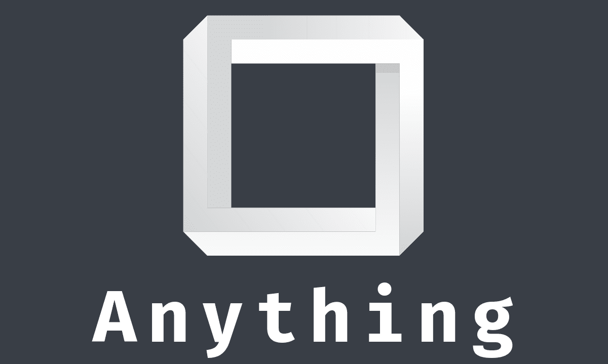
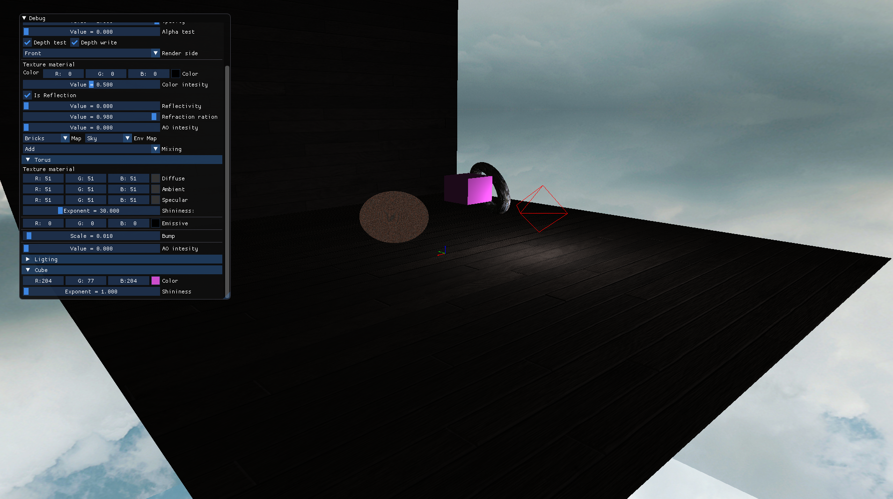
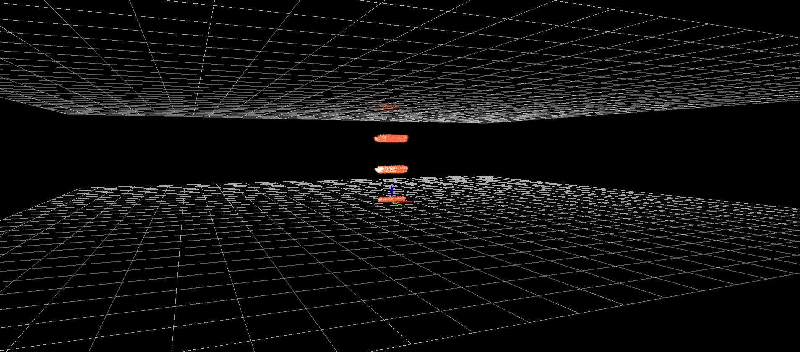
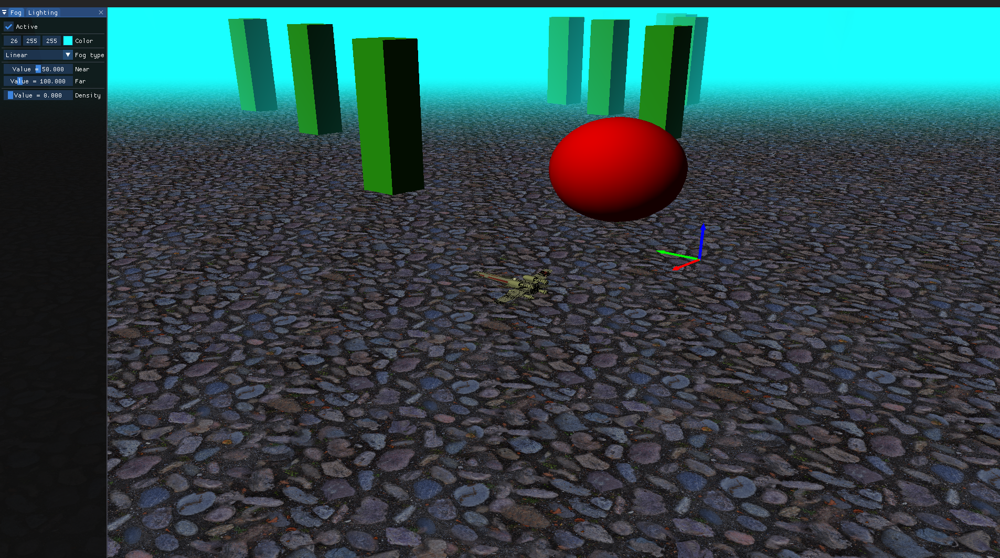
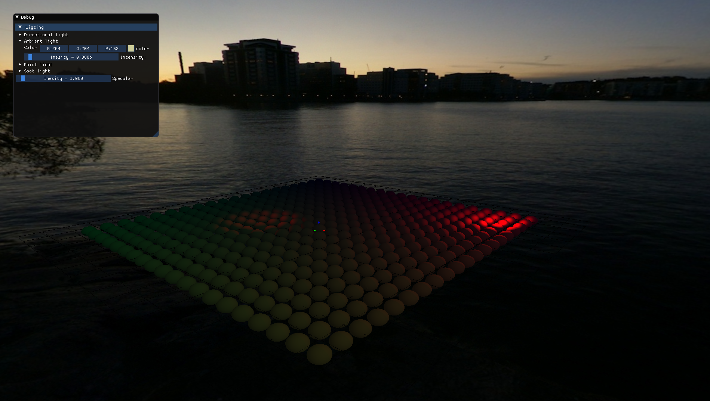

# Anything




## Abstract

&ldquo;Anything&rdquo; is my 3d game engine written from scratch in C++. I&rsquo;ve been interested in game engines for a long time but only recently I got around to developing something serious. &ldquo;Anything&rdquo; is my first big attempt to tackle the topics of 3d rendering, game engine architecture, different rendering techniques and everything that comes with that.

&ldquo;Anything&rdquo; is written with modern C++17 in mind and can compile with gcc (8,9) as well as with clang. the Architecture is loosley based on Yan Chernikov&rsquo;s ([TheCherno](https://www.youtube.com/user/TheChernoProject)) [Hazel](https://github.com/TheCherno/Hazel/) engine. I have to admit I&rsquo;ve taken a lot of inspiration from there and I&rsquo;ve also learned a ton from Cherno&rsquo;s YouTube channel. The majority the thought behind the &ldquo;Anything&rdquo; is, however, mine.

I the past I&rsquo;ve also worked with [ThreeJS](https://threejs.org/). For this reason the API of &ldquo;Anything&rdquo; can resemble the one of ThreeJS at times.

The rendering API of choice for the project is [OpenGL](https://www.opengl.org/). At some point maybe I&rsquo;ll also implement a [Direct3D](https://en.wikipedia.org/wiki/Direct3D) backend but is a plan for the far future.

**&ldquo;Anything&rdquo; is in no way close to stable or usable state. The project is in active development and it&rsquo;s not even in alpha-version yet.**


## Building


### Prerequisites

&ldquo;Anything&rdquo; uses several external libraries that have to be installed on the system before the project can be build. Those are:

-   OpenGL - for communication with graphics hardware
-   [GLFW](https://www.glfw.org/) - for creating the opengl context and creating all the necessary windows(frames) as well as the portable communicator between platforms services for input events and the application
-   [GLEW](http://glew.sourceforge.net/) - for linking the correct OpenGL functions at run time.
-   [Assimp](https://github.com/assimp/assimp) - for including various 3d scene formats.

Foe Debian based systems, you can install all of those with:

```sh
sudo apt-get install libglfw3-dev libglew-dev libgl1-mesa-dev libassimp-dev
```


Other than that, you&rsquo;ll also need standard build tools like Make, CMake and C++17 compliant compiler (Gcc, CLang)


### Building

The build process is straight forward for a CMake project

```sh
git clone https://github.com/palikar/anything
cd anything
mkdir build
cd build
ccmake ..
make -j4 install
```


## Examples

&ldquo;Anything&rdquo; also comes with several example scenes that can be build with:

```sh
cmake .. -DBUILD_ALL_EXAMPLES=TRUE
make -j4 install
```

The source files for the examples are in the `examples/` directory. Each source file constructs a single scene by using the &ldquo;Anything&rdquo; engine.


Some screenshots of the examples:










## Features so far

I&rsquo;ve put about a month worth of work so far and I&rsquo;ve implemented a lot of the features that I want to implement. A non-exhaustive lists of those is given here.

-   Input System (Input from mouse and keyboard)
-   Event dispatching system
-   [Dear ImGui](https://github.com/ocornut/imgui) support
-   Entity Component System
-   Basic Animation system
-   Basic Particle systems
-   Sky-box rendering
-   Rendered visual helpers (axis, plane, grid, camera, spot light, point light)
-   Fog rendering
-   Lighting (directional, ambient, spot and point-light )
-   Mouse picking
-   Instance rendering
-   Loading OBJ and .blend files
-   Materials - Phong material, Textured material(unaffected by lighting), Single Color material
-   Rendering primitives - lines and triangles
-   Geometry factories - sphere, cube, cylinder, circle, cone, plane, ring and torus


## Documentation

Coming eventually :)


## License

Copyright © 2020 Stanislav Arnaudov.

Distributed under the GNU General Public License, version 2
